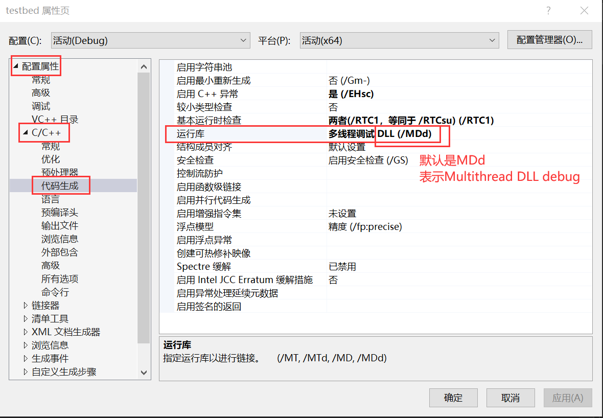
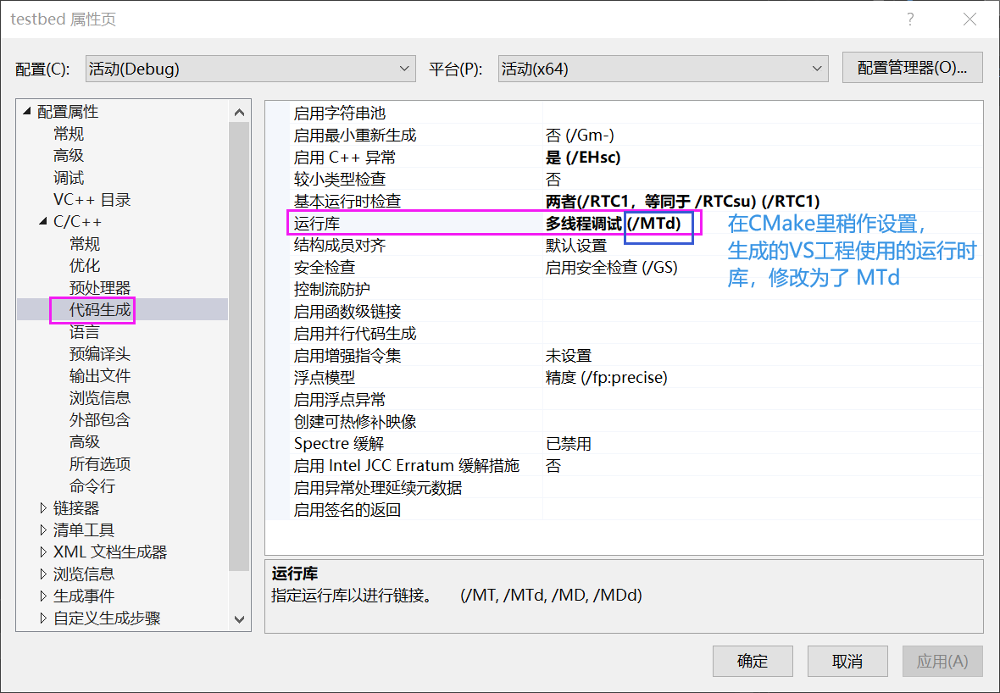

# msvc_runtime_example: 设置MSVC工程MT/MTd/MD/MDd

## 默认的运行时库
VS2022 创建的 C/C++ 工程， 默认是 MDd, 表示多线程动态库的调试版本
- M: multithreaded
- D: DLL
- d: debug



## 修改运行时库
可以修改运行时库为 MTd, 表示多线程静态库的调试版本
- MT: multithreaded static
- d: debug



下面具体说说修改运行时库的几种方法：

### 1. VS 工程右键属性，C/C++，代码生成，运行库
这个方法是说，按前面截图里的位置，直接修改。

这个方法适用于：
- 直接创建的 VS 工程（非CMake工程）
- 设置了 generator 为 Visual Studio 系列的 cmake 方式构建生成的 VS 工程

### 2. 在 CMakeLists.txt 里设置 target 的 MSVC_RUNTIME_LIBRARY 属性
```cmake
cmake_minimum_required(VERSION 3.20)

# 设置策略CMP0091为NEW，新策略
if (POLICY CMP0091)
  cmake_policy(SET CMP0091 NEW)
endif (POLICY CMP0091)

# 声明一个工程
project(msvc_runtime_example)

# 添加一个exe
add_executable(testbed testbed.cpp)

# 设置MT/MTd
set_property(TARGET testbed PROPERTY
  MSVC_RUNTIME_LIBRARY "MultiThreaded$<$<CONFIG:Debug>:Debug>")
```

其中用到生成表达式， 可参考 https://blog.csdn.net/Copperxcx/article/details/123084367

这种方式的适用情况：
1. 基于 cmake 的手动生成 VS 工程的方式
2. 直接用较新版本 Visual Studio 打开 CMakeLists.txt 文件作为工程的方式

其中， 使用较新版本 VS 打开 CMakeLists.txt 的方式， 由于生成的 target 的“右键->属性”页面显示为空（截至2022.07.22仍然如此），因此只能在 CMakeLists.txt 等配置文件中修改。